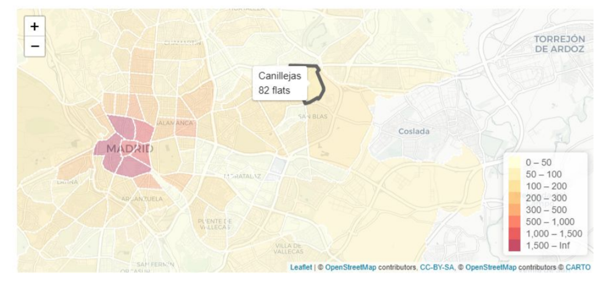
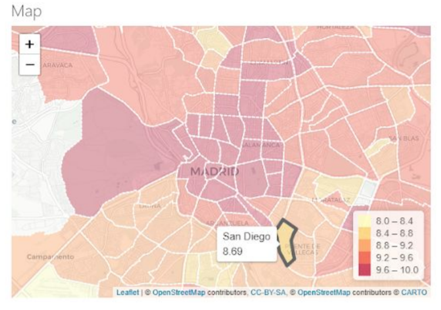
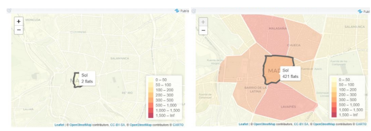

<h1 align="center">Shiny Airbnb</h1>
<h4 align="center">Visualization assignments using <a href="https://shiny.rstudio.com/">Shiny</a> at the course of Big Data on the EIT Digital data science master at <a href="https://www.upm.es/">UPM</a> </h4>

  
  
  

## Problem statement

The rise of vacation renting and platforms like Airbnb has created a lot of issues in big
cities, like Madrid. We have decided to analyze a public dataset which offers information
about Airbnb renting, dates and zones. The dataset is public in Kaggle: [Madrid Airbnb dataset](https://www.kaggle.com/rusiano/madrid-airbnb-data).

This dataset is well structured, giving the opportunity of extracting a lot of insight from it,
also it has a considerable volume of data. We chose it because of its great potential and the
various visualizations that could be extracted from it.

## Research questions

The objective of this work is to answer several questions according to the presented
problem domain using the visualization tool [Shiny](https://shiny.rstudio.com/). The questions we are trying to answer are:

- How does the renting price change depending on what neighbourhood of
  Madrid the place is? Does it vary too depending on the date?
- What are the neighbourhoods with the best ratings? (taking into account all
  the categories of the scores)
- What are the neighbourhoods with the most number of Airbnb flats? Has this
  changed over time?
- What insights can we gather from the review comments? What do clients
  value more from the Airbnb?

## Project development

The project was developed using R programming language, [Shiny](https://shiny.rstudio.com/) framework and the library [shinymaterial](https://ericrayanderson.github.io/shinymaterial/) to improve the visual appareance of the input design.

The full report can be found at [project/report.pdf](project/report.pdf) and it contains the visual approach taken to tackle the research questions, along with a guided use of the application. The interface is publicly available on the website [https://angeligareta.shinyapps.io/shinyairbnb/](https://angeligareta.shinyapps.io/shinyairbnb/) (it can take a moment to load as it is hosted in shinyapps).

## Discussion

After developing this tool and make and exhaustive study of the dataset we arrived at some interesting conclusions.

First of all, speaking about the price, we can see that the most expensive neighbourhoods
are those in the residential and fancy part of Madrid (like Salamanca and Goya), with some
exceptions due to high rent places (outliers) located in other parts of the city.

To see if this is due to a problem with the offer and demand in that zone, we can use the
other visualization to see the amount of places available in that zone. The number is really
small compared to other parts of the city like the centre, but similar to other “extra radius”
listings, which would validate our assumption that the zone is overall more expensive.

Considering the score question, we can see that mostly in all the categories, all the zones
have a good punctuation. The only exception is when we are considering the location
punctuation, because the most central places are the ones which have a highest
punctuation (Sol, Recoletos, Justicia...).

Finally, regarding the number of flats, we are going to compare for example the number of flats
that were in Sol in the year 2012 and in the year 2019. As we can see, in 2012 there were only two flats in Sol, but in 2019 there are 421. So we can conclude that each year more and more flats are added to the platform.

## Authors

- **Cristian Abrante** - [CristianAbrante](https://github.com/CristianAbrante)
- **Guillermo Antoñanzas** - [Buhorl](https://github.com/Buhorl)
- **Angel Igareta** - [angel@igareta.com](mailto:angel@igareta.com)
